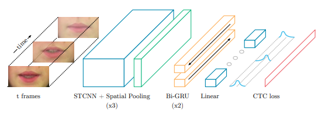

# LipNet: End-To-End Sentence-Level Lipreading

This repo is my pytorch implementation of the paper, [LipNet: End-To-End Sentence-Level Lipreading](https://arxiv.org/pdf/1611.01599v2.pdf). 

## Dependencies

This project was made using a ```requirements.txt``` for keeping track of dependencies. 

First you should create a virutalenv for the project. To do this, cd into the directory and run the command:
```
python -m venv /path/to/new/virtual/environment
```
Next you need to activate your virtual environment by running:
```
source <path/to/venv>/bin/activate
```
* Note: the above command is specific to bash/zsh. Check out [python documentation](https://docs.python.org/3/library/venv.html) for your specific shell and platform. 
Finally, to install the necessary dependencies run:
```
pip install -r requirements.txt
```

## Prerequisites

The dataset that was used in the original paper as well as in the training of this model is the [GRID Audiovisual Sentence Corpus](https://spandh.dcs.shef.ac.uk//gridcorpus/). Specifically, what this code is setup for is only training on speaker 1 utilizing the normal video and word alignments. The reason the code was set up this way was to prove the lipreading functionality of this model without generalizing to multiple speakers due to the significant increase in training time alone. If you would like to train on multiple speakers.

## Model Outline

There are 3 components to the LipNet model:
1. Spatial CNN
2. Recurrent Layers
3. Linear Layers

I utilized a general outline of the model architecture provided by the mentioned paper for the model contained within this jupyter notebook. The main difference between the paper and my model is that I utilized LSTM layers instead of GRU layers. The reason for this is due to the fact that LSTM layers have the ability to remember longer sequences. Thus, if I ever come back to this project in the future, one thing I would love to experiment with is getting this model to output a full sentence or even up to a paragraph of text, depending on the model's capabilities. Obviously, the more text the model would output, the more frames it would need to interpret. The reason the Spatial CNN layers exist is to extract features from the images of the lips as well as utilize the time dimension to help extract any further features. The recurrent layers that follow further help to extract any temporal data from the images, and the paper mentions that they are crucial to the model's success. Finally, the linear layers are utilized to predict the spoken letter at each timestep. This model utilizes CTC (Connectionist Temporal Classification) to predict the letters spoken by the speaker. [This website](https://distill.pub/2017/ctc/) does a great job of describing what the CTC algorithm is and why we use it for sequence problems.



Credit: https://arxiv.org/pdf/1611.01599v2.pdf

## Future Improvements

There are still some improvements that could be made to this project. 
* For starters, the first and probably most pressing thing that was not done within this notebook was utilizing a proper training, validation, and testing split. The reason for this is to prove that all of the code is functional and that the model and other supporting code that currently exist within the notebook have the ability to fit and even overfit the training data without any issues. Going forward, the next proper steps would be to utilize a training, validation, and testing set to fine tune the model, as well as early stopping to prevent the model from overfitting to the training data. Then the testing set would be utilized to monitor the out-of-sample performance of the model.
* This code lacks the ability to monitor metrics related to the performance of the model. The CER and WER metrics that were mentioned in the paper would still need to be implemented within the code.
* The next major improvement would be to utilize all of the speakers within the [GRID Audiovisual Sentence Corpus](https://spandh.dcs.shef.ac.uk//gridcorpus/) dataset and not just the first speaker. The main reason I have only utilized the first speaker and not the rest is to limit training time. Due to my limited computing resources, it would take too long to train on the whole dataset of 34 speakers. However, by utilizing the whole dataset and image augmentation techniques, you force the model to learn to generalize and understand multiple different lip reading patterns, orientations, and locations within a video. For example, recognizing the proper words even though different speakers may have different accents and thus different lip patterns when saying similar words would put the model on the path to taking sequences of lip images directly from a webcam and providing closed captioning without any need for audio input. 
* The final improvement that would make this model more like the paper would be to utilize a facial keypoint model to extract the lips from an image. As it exists within the code right now, it just takes a slice of the image over all frames of a video. This implementation is not perfect by any means since it cannot generalize well to different videos, and if the speaker were to move any significant amount, then there would not be any images of lips within those frames. The full and more generalized approach would be to utilize the [facial keypoint detection model](https://github.com/josephfemia/Facial_Keypoint_Detection) that I built to locate the lips within an image and then pass the cropped image of just the lips over time to this model to ultimately output the text version of what the speaker is saying.
